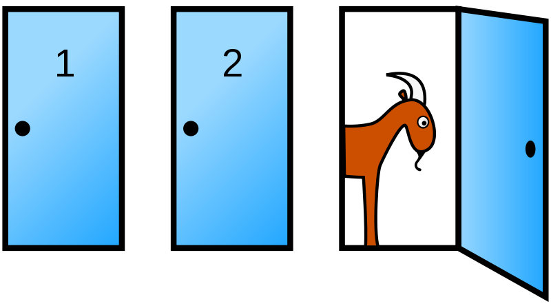

三门问题也被称为蒙提霍尔问题，传言出自于美国的电视游戏节目 Let's Make a Deal。

游戏是这样设置的，参赛者会面对三扇门，其中一扇门后面有一辆汽车，另外两扇门后面是两头羊。参赛者自由选择一扇门，然后主持人会开启剩下两扇门中的一扇，露出其中一头羊。这时候，主持人会询问参赛者要不要改变选择。如果是你，你会改变选择么？

答案是应该改变选择，换剩下那扇门赢得汽车的概率是 $\frac{2}{3}$，不换赢得汽车的概率只有 $\frac{1}{3}$。
很多人会认为改不改变选择其实无所谓，打开一扇门之后，还剩下两扇门，这两扇门后面有一辆车和一头羊，所以改变选择赢得汽车的概率为 $\frac{1}{2}$。而根据答案，改变选择赢得汽车的概率是 $\frac{2}{3}$，大于 $\frac{1}{2}$，说明主持人打开一扇门露出羊的行为，远比我们想象的提供了更多的信息。

# 使用条件概率计算

事实上，这是一个条件概率问题。记参赛者改变选择赢得汽车为事件 $A$，参赛者第一次选择的那扇门后是汽车为事件 $B_{1}$，第一次选择的那扇门后是羊为事件 $B_{2}$，主持人打开的门后面是羊为事件 $C$。那么我们要求的概率为：

$$
P(A/C) = \frac{P(AC)}{P(C)}
$$

这里，$P(AC)$ 为主持人打开的门后面是羊，同时参赛者改变选择赢得汽车的概率，我们可以使用全概率公式求解，即分两种情况，参赛者第一次选择的那扇门后是汽车，与参赛者第一次选择的那扇门后是羊：

$$
\begin{aligned}
P(AC) &= P(AC/B_{1}) \times P(B_{1}) + P(AC/B_{2}) \times P(B_{2}) \\\
P(AC) &= 0 \times \frac{1}{3} + 1 \times \frac{2}{3} \\\
P(AC) &= \frac{2}{3}
\end{aligned}
$$

不难理解，当参赛者第一次选择的门后是车时，此时主持人随意选择一扇门，参赛者改变选择赢得汽车的概率为 0，即 $P(AC/B_{1})$ 为 0。当参赛者第一次选择的门后是羊时，由于主持人知道剩下的两扇门背后的情况，那么他一定会打开有羊的那扇门，此时参赛者改变选择赢得汽车的概率为 1，即 $P(AC/B_{2})$ 为 1。由此可以计算出 $P(AC)=\frac{2}{3}$。

同理我们也可以用全概率公式计算 $P(C)$:

$$
\begin{aligned}
P(C) &= P(C/B_{1}) \times P(B_{1}) + P(C/B_{2}) \times P(B_{2}) \\\
P(C) &= 1 \times \frac{1}{3} + 1 \times \frac{2}{3} \\\
P(C) &= 1
\end{aligned}
$$

事实上，无论参赛者第一次选择的门背后是车还是羊，主持人打开的门背后是羊的概率都为 1，因为主持人知道门背后的情况。

由此我们可以计算出在主持人打开的门后面是羊的情况下，参赛者改变选择赢得汽车的概率为：

$$
P(A/C) = \frac{\frac{2}{3}}{1} = \frac{2}{3}
$$

# 如果主持人不了解门后的情况呢？

通过上面的计算，我们发现主持人打开剩下的一扇门提供了更多的信息，本质上是因为主持人了解门背后的情况。那么，如果我们假设主持人不知道门背后的情况，记事件 $C$ 为主持人打开剩下一扇门，那扇门背后恰好是羊，那么这个时候我们要不要改变选择呢？

我们依然可以使用条件概率和全概率公式来计算：

$$
\begin{aligned}
P(A/C) &= \frac{P(AC)}{P(C)} \\\
P(A/C) &= \frac{P(AC/B_{1}) \times P(B_{1}) + P(AC/B_{2}) \times P(B_{2})}{P(C/B_{1}) \times P(B_{1}) + P(C/B_{2}) \times P(B_{2})} \\\
P(A/C) &= \frac{0 \times \frac{1}{3} + \frac{1}{2} \times \frac{2}{3}}{1 \times \frac{1}{3} + \frac{1}{2} \times \frac{2}{3}} \\\
P(A/C) &= \frac{1}{2}
\end{aligned}
$$

正好是 $\frac{1}{2}$，符合我们的直觉，参赛者改不改变选择都一样。这里需要注意，此时 $P(C)$ 不为 1，因为主持人不清楚门背后的情况。$P(AC/B_{2})$ 也不等于 $\frac{2}{3}$，因为当参赛者第一次选择的门后是羊时，主持人打开剩下一扇门背后恰好是羊的概率为 $\frac{1}{2}$。

# 一个简单的想法

一个简单的想法是参赛者第一次选到车的概率为 $\frac{1}{3}$，车在剩下两扇门的概率为 $\frac{2}{3}$。主持人打开一扇门后，这 $\frac{2}{3}$ 的概率都被挤到剩下那扇门上去了，所以参赛者改变选择赢得汽车的概率为 $\frac{2}{3}$。

另外一个想法是，假设有 1000 扇门，你首先选择了一扇门，然后主持人打开了剩下的 999 扇门中的 998 扇门，门后都是羊。那么这个时候你还会坚持最初的选择么？你会认为自己就是那个上天眷顾的人，一开始就做了正确的选择么😀