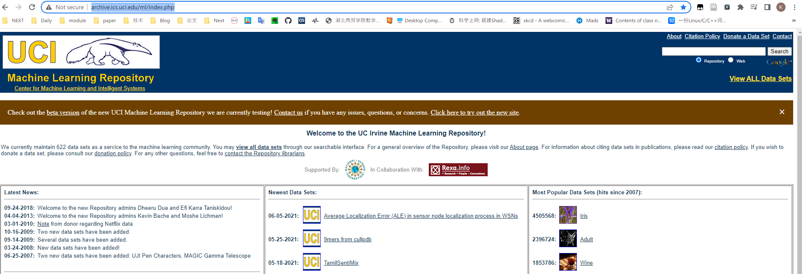
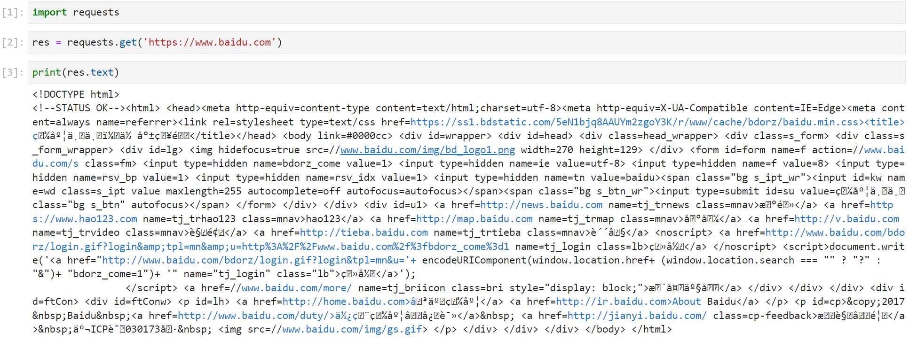
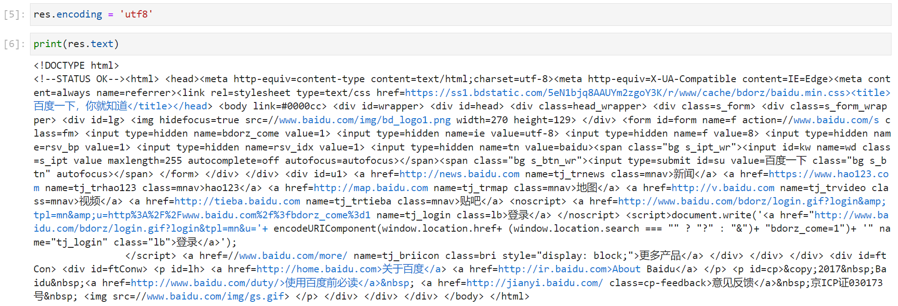
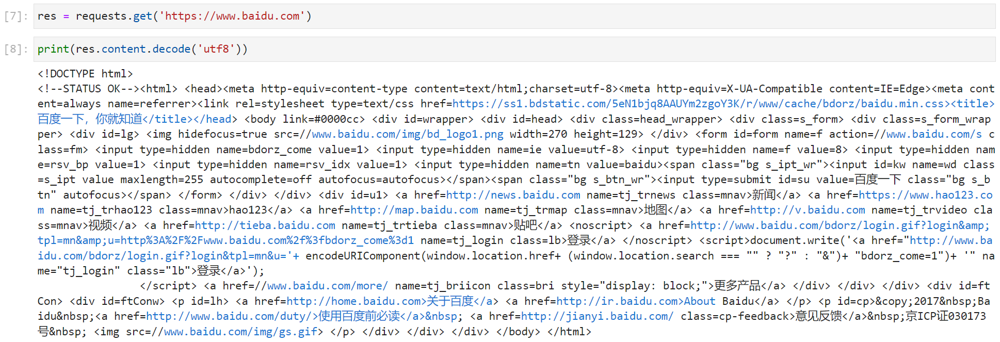

这篇文章既是面向像我这种经管类非科班同学的爬虫教程，也是我自己对于爬虫学习的一个总结。

# 1 爬虫基础

一般来说，网络爬虫就是模拟客户端向服务器端发送网络请求，接收请求响应，对响应内容进行自动解析从而获取目标信息的程序。这里的客户端主要是指浏览器。因此，为了理解爬虫的工作原理，我们有必要了解浏览器的工作原理。

## 1.1 在浏览器的地址栏中输入 URL 并回车之后发生了什么？

URL（Uniform Resource Locator，统一资源定位符）一般称为网页地址，即网络上某个资源的地址，比如 ”http://archive.ics.uci.edu/ml/index.php“，这是 UCI 机器学习数据集的网页地址。在浏览器的地址栏中输入这个地址并回车，我们会见到如下页面：

此时，我们获取了服务器端发送过来的数据。我们可以看一看这些数据，鼠标右键选择检查，进入开发者工具，点击 index.php，我们可以看到，这个数据是一个 document 类型的文件。点击 Preview，我们可以看到这个文件就是页面所展示的内容。

简单来说，浏览器就是这样一个程序，帮我们向服务器端发送请求，获取响应，然后将响应内容进行解析和渲染，最终呈现给我们的就是如上图所示的页面。你可以将浏览器理解为一个邮差，他帮我们送信，同时也送回回信。

以上只是一个简化的表达，那么具体来说浏览器做了哪些工作呢？

- URL 解析：当我们在地址栏中输入一个 URL 并回车，浏览器首先判断我们输入的是一个合法的 URL 还是一个待搜索的关键词。如果是搜索内容，浏览器会使用默认的搜索引擎，合成带有搜索内容的 URL；如果是请求的 URL，则根据规则判断 URL 是否完整，不完整则根据规则合成完整的 URL
- DNS 查询：其次，浏览器会根据 URL 地址查找对应的 IP 地址。前面提到过，URL 地址是网络上资源存在的地址，对于我们人类来说比较好记忆，但是对于计算机来说并不好处理，计算机更擅长处理数字，因此便有了 IP 地址。IP（Internet Protocol）地址指明了发送方的地址，是网络上的一个虚拟地址。有了地址，浏览器便可以发送请求。
- TCP 连接：客户端与服务器要相互通信，双方就要基于相同的方法和规则，我们将这种规则称为协议。比如两个人要打电话通信，我们规定都使用中文作为沟通语言，这就是一种协议。浏览器在于服务器进行通信时，为了确保数据可以准确的进行传送，采用了 TCP 协议。TCP 协议要求客户端在与服务器通信之前需要先建立 TCP 连接，你可以理解为两个人要通信前需要先连一条电话线。关于这部分内容，大家可以参考《图解 HTTP》。
- 发出请求：通过前面的步骤，我们已经得到服务器的地址，同时建立了 TCP 连接，下面浏览器就会开始构造 HTTP 报文，发送 HTTP 请求。其中，报文包括：
  - 请求报头（Request Header）：请求方法、目标地址、遵循的协议等等
  - 请求主体
- 接受响应：服务器接收到浏览器发出的请求，会返回相应的响应资源。浏览器接收到响应资源后，会对资源进行分析。首先查看 Response Header，根据不同的状态码做不同的事。如果响应资源进行了压缩（比如 gzip），还需要进行解压。然后，对响应资源做缓存。接下来，根据响应资源里的 MIME（Multipurpose Internet Mail Extensions，媒体类型）类型去解析响应内容。
- 渲染页面：浏览器自动发送请求获取嵌入在 HTML 中的资源（图片、音频、视频、CSS、JS 等等）

**参考资料**

- 《图解 HTTP》
- https://juejin.cn/post/6844903922084085773
- https://zhuanlan.zhihu.com/p/133906695
- https://juejin.cn/post/6975307495808237604

## 1.2 HTTP 协议

http 与 https 区别

HTTPS 比 HTTP 更安全，但是性能更低。HTTP，超文本传输协议，默认端口是80。超文本：指不仅限于文本，还包括图片、音频、视频等文件。传输协议：使用共同约定的固定格式来传递转换成字符串的超文本内容。

HTTPS：HTTP + SSL（安全套接字层），即带有安全套接字层的超文本传输协议，默认端口号443。SSL 对传输的内容进行加密

**请求头**

- Content-Type
- Host（主机和端口号）
- Connection（链接类型）
- Upgrade-Insecure-Requests（升级为 HTTPS 请求）
- **User-Agent**（用户代理：提供系统信息与浏览器信息）
- **Referer**（页面跳转处，防盗链）
- **Cookie**（状态保持）
- Authorization（用于表示 HTTP 协议中需要认证资源的认证信息）

**响应头**

- **Set-Cookie**

**常见的响应状态码**

- 200：成功
- 302：跳转，新的 URL 在响应的 Location 头中给出
- 303：浏览器对于 POST 的响应重定向至新的 URL
- 307：浏览器对于 GET 的响应重定向至新的 URL
- 403：资源不可用；服务器理解客户的请求，但拒绝处理它（没有权限）
- 404：找不到该页面
- 500：服务器内部错误
- 503：服务器由于维护或者负载过重未能应答，在响应中可能会携带 Retry-After 响应头；有可能是因为爬虫频繁地访问，使服务器忽视爬虫请求，最终返回 503 响应状态码

**一切的状态码都不可行，一切都以是否从抓包得到的响应中获取到的数据为准**

**Network 中抓包得到的源码才是判断依据，Elements 中是浏览器渲染之后的源码，不能作为判断标准**

# 2 一个简单的爬虫

前面我们已经提到爬虫就是通过模拟浏览器，发送请求，接收响应数据。那么如何向目标服务器发送请求呢？Python 的第三方库 [Requests](https://docs.python-requests.org/zh_CN/latest/) 为我们提供了良好的接口。下面的代码是向百度发送一个 Get 请求：

首先我们导入 requests 库，然后调用 get 方法发送请求，最后打印出字符串类型的响应内容（`print(res.text)`）。这里我们可以观察到打印出的内容里面还有乱码。这是因为在网络中传输的字符串都是 bytes 类型的，而 `res.text` 是 requests 模块按照 [chardet](https://www.liaoxuefeng.com/wiki/1016959663602400/1183255880134144) 模块推测出来的字符集进行解码的结果。我们可以打印出推测出来的字符集，如下图：

如上图所示，推测出来的字符集为“ISO-8859-1”。我们可以鼠标右键，选择检查，打开开发者工具，点击 Elements，键盘按下 Ctrl + f 搜索 charset，参考该字符集进行手动编码，如下图：

如上图所示，我们可以使用 utf8 字符集进行手动编码，如下图：

除了使用 `res.text` 并进行手动编码，我们也可以先获取 bytes 类型的数据再进行手动解码（decode），如下图：

# 3. 爬虫深入

## 3.1 抓包分析